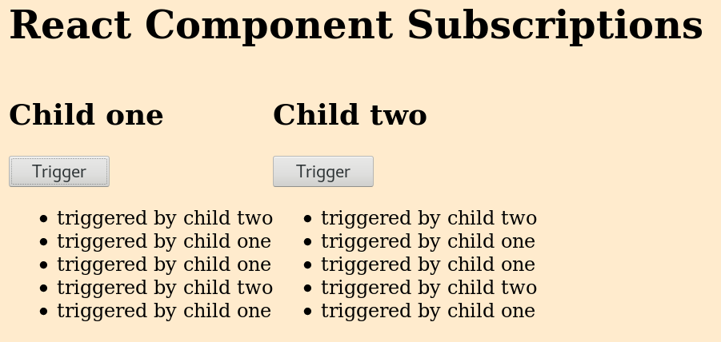

# React Component Subscriptions

This is the implementation of an event subscription pattern used by sibling React components.

To run this, clone this repo, and `npm run dev`.

This is what it looks like:

